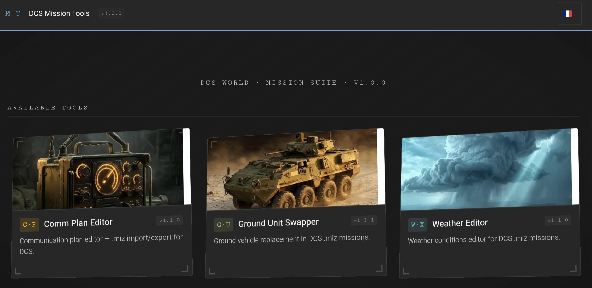

# DCS Mission Tools



> Edit your DCS World mission files surgically — three editors in one offline page. **Download a single file, drop a `.miz`, edit, save.**

    

🌐 **[Use it online »](https://mirabellebenou.github.io/dcs-mission-tools/)** · 💾 **[Download the offline file »](https://github.com/MirabelleBenou/dcs-mission-tools/releases)**

A single-page **workshop** that bundles a suite of surgical `.miz` editors for DCS World virtual pilots and wings. It runs entirely in your browser — **online for those who don't want to download**, or as **one offline HTML file** you can keep, share, and use without internet. Drop a `.miz`, edit it, save — the mission **never leaves your machine**, and your original is left untouched.

Developped with the help of Claude AI (I'm not a dev !)

---

## 📱 Built for the tablet (and your phone)

Mission Tools is designed to be used **where you actually fly** — on a tablet next to your stick, or on your phone. Editing your mission shouldn't mean alt-tabbing out of the cockpit.

- **Touch-first UI** — large tap targets, drag-and-drop the `.miz`, no tiny desktop-only controls
- **Responsive layout** — adapts from desktop down to phone
- **Rotation-safe** — keeps working when you flip the tablet between landscape and portrait
- **No install** — open a link or a single file in the mobile browser; works offline once loaded
- **Edit on the go** — drop a `.miz`, edit, and save a new one straight from the device

## 🔒 Local-first & non-destructive

Mission Tools edits the **actual mission file**, with surgical precision and nothing sent anywhere.

- **100% local** — JSZip is bundled in; the `.miz` is never uploaded
- **Surgical patching** — the `.miz` is patched in place, not rewritten from scratch
- **Strict preservation** — critical data is kept intact (groups/units are read-only so CTLD/MOOSE scripts don't break; the mission's companion files are preserved)
- **Non-destructive** — saving downloads a new `.miz`; your original stays as-is

## 🧰 The suite

The landing page presents each editor as a tile. Active tools open in place; upcoming ones are stamped *Coming soon*.

| Tool                            | What it does                                                                                                                | Status      |
| ------------------------------- | --------------------------------------------------------------------------------------------------------------------------- | ----------- |
| **Comm Plan Editor** (`C·P`)    | Edit the communications plan — radio frequencies and presets                                                                | ✅ `v1.2.0` |
| **Ground Unit Swapper** (`G·U`) | Bulk-swap ground unit types and skill, filtered by coalition / group / family                                               | ✅ `v1.2.0` |
| **Weather Editor** (`W·X`)      | Edit date/time, wind layers, clouds and precipitation — 34 presets                                                          | ✅ `v1.2.0` |
| **Foothold Configurator** (`F·C`)| Tune Foothold-style mission parameters                                                                                      | ⏳ Planned  |
| **Loadout Editor** (`L·E`)      | Edit aircraft loadouts and payloads                                                                                         | ⏳ Planned  |

> Each tool is a standalone HTML editor; the page bundles the live tools and shares a single working `.miz` between them.

### 📡 Comm Plan Editor — in detail

The Comm Plan Editor reads your mission's **communications plan** and lets you edit **radio frequencies and presets** with surgical precision.

- **Lua-aware** — full tokenizer → AST parser → model extraction → in-place patch pipeline
- **Surgical patching** — only the edited values are rewritten; the rest of the `.miz` is left byte-for-byte intact
- **Companion files preserved** — scripts, kneeboards and other embedded files are kept
- **Bilingual FR / EN**, choice remembered

### 🪖 Ground Unit Swapper — in detail

The Ground Unit Swapper lets you **bulk-swap ground unit types and skill** across the mission, with powerful filtering — handy for re-theming a mission or adjusting threat density.

- **Filter** by coalition, group and **family** — Armor, Artillery, **AirDef** (SAM + AAA), Radar / EWR, **Unarmed** (logistics + infrastructure / C2), Infantry
- **Swap by type** — change unit types in bulk; livery is preserved
- **Skill editable** — Average / Good / High / Excellent
- **Safe by design** — `Client` / `Player` units excluded; **group and unit names are strictly read-only** so CTLD / MOOSE / scripted logic keeps working
- **Bilingual FR / EN**, choice remembered

### 🌦️ Weather Editor — in detail

The Weather Editor gives you full control over **mission weather**, from a quick preset to a fully custom setup.

- **Date & time** (UTC), **wind on 3 layers**, **clouds** (preset / base / precipitation)
- **34 presets** with thumbnails
- **Handles both** preset-based and fully custom weather structures
- **Read-only context** for derived values (QNH, temperature, visibility…) so nothing inconsistent is written
- **Bilingual FR / EN**, choice remembered

## ✨ Features

- **Fully offline** — one HTML file, no install, no server, no internet
- **One page, three editors** — bundled tiles, a single working `.miz` shared between tools
- **Shared working file** — the same `.miz` flows from one tool to the next; edits accumulate until you save
- **Surgical, non-destructive** — patched in place; a new `.miz` is downloaded, the original is untouched
- **Strict preservation** — read-only groups/units, kept companion files
- **Bilingual** — full FR / EN toggle, choice remembered

## 📸 Screenshots


## 🚀 Quick Start

**Option A — online (nothing to download)**

1. Open **[the hosted version](https://mirabellebenou.github.io/dcs-mission-tools/)** in your browser (works on phone/tablet too)
2. Pick a tool, drop a `.miz`, and edit

**Option B — offline file**

1. Download the latest `dcs_mission_tools.html` from the [Releases](https://github.com/MirabelleBenou/dcs-mission-tools/releases) page
2. Open it in any modern browser (Chrome recommended) — on PC or tablet
3. Pick a tool, **drop a `.miz`** and edit

In both cases, **Save** downloads a new `.miz` (your original is left untouched).

> Tip: always keep a backup of your missions before editing. No account, no internet required after the first load.

## 📓 Changelog

See [CHANGELOG.md](https://github.com/MirabelleBenou/dcs-mission-tools/blob/main/CHANGELOG.md) for the per-tool version history.

## 🏗️ Building from source

The page is **built**, not hand-written: `build_mission_tools.py` reads the module sources and tiles, base64-encodes them, and produces the single file.

### Prerequisites

- Python 3.8+ (standard library only)

### Build

```
python3 build_mission_tools.py        # → dcs_mission_tools.html
```

The output `dcs_mission_tools.html` is the distributable (and the file published on Releases).

### Project structure

```
.
├── build_mission_tools.py     # shell + bundler (embeds modules + tiles)
├── modules/                   # standalone editors (source of truth)
│   ├── dcs_comm_plan_editor.html
│   ├── dcs_ground_unit_swapper.html
│   └── dcs_weather_editor.html
├── tiles/                     # landing tiles (512² WebP): cp, gu, wx
├── dist/                      # built output: dcs_mission_tools.html
├── CHANGELOG.md
├── README.md
└── LICENSE
```

> The **source of truth** is each standalone module (never the built file). Filenames carry **no version** — versioning lives in GitHub tags / releases.

## 🗺️ Roadmap

- ⏳ **Foothold Configurator** (`F·C`) — tune Foothold-style mission parameters
- ⏳ **Loadout Editor** (`L·E`) — edit aircraft loadouts and payloads
- ⏳ **UI polish** and shared language toggle across shell and tools

## 🤝 Contributing

Bug reports and feature suggestions are welcome via the [Issues](https://github.com/MirabelleBenou/dcs-mission-tools/issues) page.

For code contributions: fork, branch, study the build script to understand the architecture, test by rebuilding and opening the result in a browser, then open a pull request.

## ⚠️ Compatibility

- **Chrome / Edge** (recommended): all features
- **Firefox / Brave**: supported
- **Mobile browsers** (Android / iOS): supported and a first-class target — touch, drag, rotation

## 📄 License

[MIT License](https://github.com/MirabelleBenou/dcs-mission-tools/blob/main/LICENSE) — free to use, modify, and distribute, including commercially.

## 🙏 Acknowledgments

- Built for the DCS World virtual aviation community
- Initial version developed for the **4th VEAW** virtual wing — distributed as generic, public tools
- A companion to **[DCS Mission Plan](https://github.com/MirabelleBenou/dcs-mission-plan)** (briefings, recon, HQ)

---

*This project is not affiliated with or endorsed by Eagle Dynamics, the developers of DCS World.*
